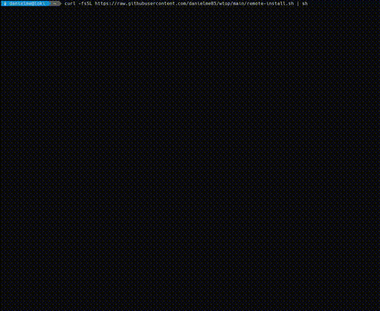

<p align="center">
  <h1 align="center">WhaleTop</h1>
  <p align="center">
    A fast, async Docker container monitor for your terminal.
    <br />
    Built with Rust. Powered by the Docker socket. No overhead.
  </p>
</p>

<p align="center">
  
  
  
  
  
  
</p>

<p align="center">
  
</p>

---

## Features

- **Live container monitoring** — configurable refresh rate (250ms to 2s) with minimal resource usage
- **Multi-page views** — List, Detail, Resources (CPU/MEM/Disk/Net sparklines), and Logs
- **Background stats polling** — optional per-container stats collection preserves graph history across container switches
- **Customizable columns** — toggle ID, Name, Image, Status, CPU, MEM, Disk, Network with optional inline mini bar graphs
- **Container actions** — start, stop, restart, pause, unpause, kill, remove directly from the TUI
- **Log viewer** — auto-scrolling with configurable buffer size (100–1000 lines)
- **Direct socket access** — connects to `/var/run/docker.sock` via [Bollard](https://github.com/fussybeaver/bollard) (no shelling out)
- **Fully async** — [Tokio](https://tokio.rs) runtime drives Docker API calls and input handling concurrently
- **4 color themes** — Norse (default), Light, Dark, Monochrome
- **Persistent settings** — all preferences saved to `~/.config/wtop/settings.toml`

---

## Install

### Homebrew (macOS)

```bash
brew install danielme85/tap/wtop
```

### From source

```bash
git clone https://github.com/danielme85/wtop.git
cd wtop
cargo build --release

# Or use the install script (builds + copies to ~/.local/bin):
./local-build-and-install.sh
```

### Pre-built binary (Linux amd64 / arm64)

The quickest way to install. The [install script](https://github.com/danielme85/wtop/blob/main/remote-install.sh) auto-detects your architecture (amd64 or arm64), downloads the latest release binary from GitHub, and places it in `~/.local/bin` (or `~/bin`). No authentication required.

```bash
curl -fsSL https://raw.githubusercontent.com/danielme85/wtop/main/remote-install.sh | sh
```

You can override the install location with `INSTALL_DIR`:

```bash
curl -fsSL https://raw.githubusercontent.com/danielme85/wtop/main/remote-install.sh | INSTALL_DIR=/usr/local/bin sh
```

Or if you prefer to download manually, grab the binary for your platform from the [Releases page](https://github.com/danielme85/wtop/releases).

### Docker

```bash
docker buildx build --platform linux/amd64,linux/arm64 -t wtop .
docker run -it -v /var/run/docker.sock:/var/run/docker.sock wtop
```

### Cross-compilation

```bash
cross build --target aarch64-unknown-linux-gnu
```

---

## Quick Start

```bash
wtop          # launch the TUI
              # press 'q' to quit
```

### CLI Options

| Flag | Description |
|------|-------------|
| `--version`, `-V` | Print version, build date, branch, and commit hash |
| `--update` | Check GitHub for a newer release and self-update |
| `--reinstall` | Force reinstall of the latest release (even if already up to date) |

---

## Navigation

| Key | Action |
|-----|--------|
| `Up` / `Down` | Navigate containers or scroll content |
| `Right` / `Left` | Switch pages: List &rarr; Detail &rarr; Resources &rarr; Logs |
| `Enter` | Open action menu for selected container |
| `PgUp` / `PgDn` | Switch container on detail/resources/logs pages |
| `s` | Open settings (from any page) |
| `a` | Toggle auto-scroll (logs page) |
| `q` | Quit |

---

## Settings

All settings are editable in-app via the Settings page (`s` key) and persisted to:

```
~/.config/wtop/settings.toml
```

| Setting | Options | Default |
|---------|---------|---------|
| **Aggregation Mode** | Average, Max, Last | Average |
| **Aggregation Window** | 0.25s to 5.0s (in 0.25s steps) | 1.0s |
| **Color Theme** | Norse, Light, Dark, Monochrome | Norse |
| **Refresh Rate** | 250ms, 500ms, 1s, 2s | 250ms |
| **Log Buffer Size** | 100, 200, 500, 1000 lines | 200 |
| **Poll All Containers** | Off, On | Off |
| **Column Visibility** | ID, Name, Image, Status, CPU, MEM, Disk, Network (toggle each) | ID, Name, Image, Status |
| **Mini Bars** | CPU, MEM, Disk, Network (toggle each) | All off |

> **Tip:** Enable *Poll All Containers* to collect background stats for every running container. This preserves sparkline graph history when switching between containers, and enables live activity indicators on the list page.

---

## Tech Stack

| Crate | Purpose |
|-------|---------|
| [**Ratatui**](https://ratatui.rs) + **Crossterm** | Terminal UI rendering (immediate mode) |
| [**Bollard**](https://github.com/fussybeaver/bollard) | Async Docker Engine API client |
| [**Tokio**](https://tokio.rs) | Async runtime |
| [**Serde**](https://serde.rs) + **TOML** | Settings serialization |

---

## Built with Claude Code

This project was built with [Claude Code](https://docs.anthropic.com/en/docs/claude-code) by Anthropic — an agentic coding tool that lives in the terminal. Claude Code assisted with architecture decisions, implementation, refactoring, and documentation throughout development.

---

## License

MIT
